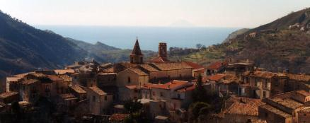

# 3d_il_mio_primo_progetto_Palermo #
I borghi d'Italia

Benvenuti nel **Mio Progetto**

In questo progetto vi descrivo un bellissimo borgo che si chiama **LAGO**:two_hearts:

Comune Italiano di 2000 abitanti circa della provincia di Cosenza.
Lago è situato a sud est del capoluogo, a metà strada tra il litorale tirrenico amanteano e l altopiano di Potame.

